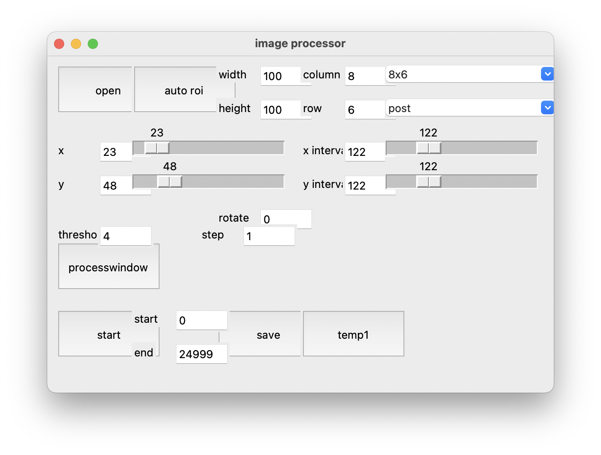

# image subtract and measure

## Overview
This script handle a series of jpg images and process them with image subtraction method to detect motion of objects in each roi.

This was written for image subtraction and motion detection step of the Rapid C. elegans motion imaging (Remi) system.

Images obtained by [`imcap_picam.py`](https://github.com/t3kawano/imagecapture_picam) are suitable input for this script.

## Requirement
- python3

## Installation
Setup python3 environment.

Put the `imagesubtandmesure.py` into somewhere your computer.

## Usage
Run the script. It will show the GUI as below.

Click Open button. Folder chooser dialog will appears. Select a folder that containing images taken by `imcap_picam.py`

You will see the 1st image of the time laps.
Adjust roi (indicated as yellow rectangles after you click any sliders) size, position etc. using sliders on the GUI panel, and if you satisfied them, click run.

>[!NOTE]　Currently, likely caused by incomplete implementation of tk gui library on MacOS, the gui response is slow and you have to click title bar before change sliders. Other gui library may be used in the future.

A window with gray images will appears. It showing subtracted images currently processing. If you see black and white objects, it means there is a moving object. The program calculate the area of the moving object of each roi. 

Click save button to save a .csv file in the same directory of the images. The contents of the output file is as follows. Each column indicate each roi, and each row means each image.

<!-- 
## Note
## Features 
## Author -->

## Reference
Kawano, Taizo et al. “ER proteostasis regulators cell-non-autonomously control sleep.” Cell reports vol. 42,3 (2023): 112267. doi: 10.1016/j.celrep.2023.112267

## License
MPL-2.0
